# Opportunity state machine

```mermaid
flowchart LR
  DISCOVERED --> SCREENING --> SUPPLIER_REVIEW --> SUPPLIER_APPROVAL --> RFQ_PENDING
  RFQ_PENDING --> RFQ_SENT --> QUOTE_RECEIVED --> NEGOTIATING --> INSPECTION_PENDING
  INSPECTION_PENDING --> INSPECTION_COMPLETE --> PURCHASE_APPROVAL --> APPROVED --> PURCHASED
  PURCHASED --> DISMANTLING --> PACKING --> READY_TO_SHIP --> SHIPPED --> IN_TRANSIT
  IN_TRANSIT --> CUSTOMS --> RECEIVING --> RECEIVED --> CLOSED

  SCREENING -.-> REJECTED
  SUPPLIER_REVIEW -.-> REJECTED
  SUPPLIER_APPROVAL -.-> REJECTED
  NEGOTIATING -.-> REJECTED
  INSPECTION_COMPLETE -.-> REJECTED
  PURCHASE_APPROVAL -.-> REJECTED

  DISCOVERED -.->|any active status| FROZEN
  FROZEN -.->|resumes to the exact status it was frozen from| DISCOVERED
```

## Enforcement (defense in depth)

1. **`packages/shared/src/state-machine.ts`** — the single source of truth
   for allowed transitions, unit-tested in `tests/unit/state-machine.test.ts`.
   The dashboard/API validates against this before ever touching Postgres.
2. **`database/migrations/004_opportunities.sql`** — a trigger
   (`enforce_opportunity_transition`) mirrors the same rules directly on the
   `opportunities` table, so even a hand-written `UPDATE` or a bug in the
   application layer cannot skip a step. It also records
   `frozen_from_status` automatically whenever a row transitions to `FROZEN`,
   so resuming later always goes back to the correct status.

## FROZEN is special

Any active status may transition to `FROZEN` (triggered by a `CRITICAL`
fraud result — see `docs/safety-rules.md`). `FROZEN` may only transition
back to the exact status recorded in `frozen_from_status` — never forward,
and never to a different status than where it was frozen. This is checked
both in `canTransition()` and in the database trigger.

## Terminal statuses

`CLOSED` and `REJECTED` have no outgoing transitions. A closed or rejected
opportunity is not archived/deleted — its full history stays in
`audit_logs` and in the row itself.
